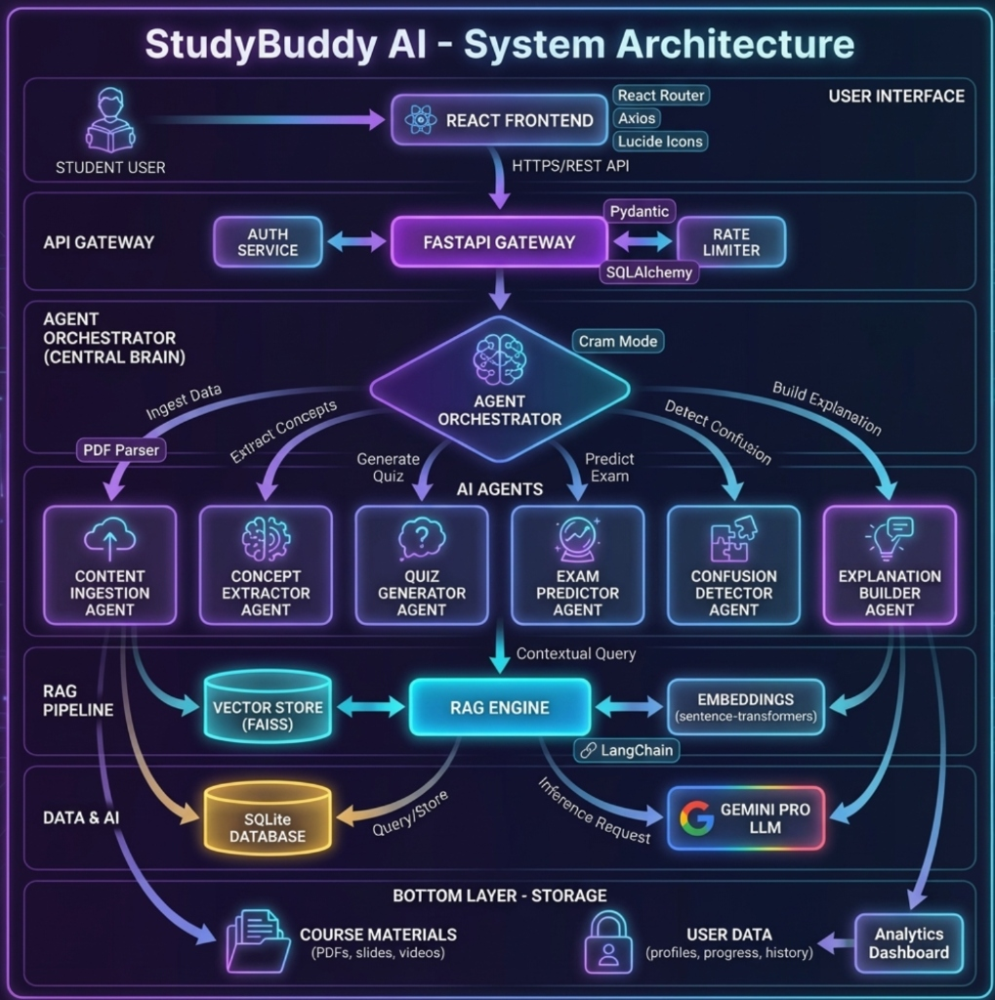

# StudyBuddy AI - System Architecture

This diagram represents the complete architecture of the StudyBuddy AI platform.

## Layer Overview

| Layer | Components | Description |
|-------|-----------|-------------|
| **Layer 1: User Interface** | React Frontend, React Router, Axios, Lucide Icons | Student-facing web application with real-time updates |
| **Layer 2: API Gateway** | FastAPI, Auth Service, Rate Limiter, Pydantic, SQLAlchemy | RESTful API with JWT authentication and request validation |
| **Layer 3: Orchestration** | Agent Orchestrator, Cram Mode | Central brain that routes requests to specialized AI agents |
| **Layer 4: AI Agents** | Content Ingestion, Concept Extractor, Quiz Generator, Exam Predictor, Confusion Detector, Explanation Builder | Six specialized agents for different learning tasks |
| **Layer 5: RAG Pipeline** | Vector Store (FAISS), RAG Engine, Embeddings, LangChain | Retrieval-Augmented Generation for context-aware responses |
| **Layer 6: Data & AI** | SQLite Database, Gemini Pro LLM | Persistent storage and AI inference |
| **Layer 7: Storage** | Course Materials, User Data, Analytics Dashboard | PDFs, slides, user profiles, and progress tracking |

## Key Technologies

- **Frontend**: React, React Router, Axios, Lucide Icons, CSS
- **Backend**: FastAPI, Pydantic, SQLAlchemy, Python async/await
- **AI/ML**: Google Gemini Pro, LangChain, Sentence-Transformers
- **Storage**: SQLite, FAISS Vector Store
- **Security**: JWT, bcrypt, CORS

## Architectural Justification

1. **Central Orchestrator**: All requests go through a central router that decides which agent is best suited for the task.
2. **Multi-Agent System**: Six specialized agents work in parallel, each focused on a specific learning capability.
3. **RAG Pipeline**: Combines vector search with LLM generation for accurate, context-aware responses.
4. **Shared Resources**: All agents utilize the same Data Layer (FAISS/SQLite) and Intelligence Layer (Gemini Pro).
