# System Architecture Diagram

This diagram represents the logical flow of the StudyBuddy AI platform.

```mermaid
graph TD
    %% User Layer
    User[👤 Student] -->|HTTPS| Frontend[� React Frontend]
    Frontend -->|REST API| API_Gateway[🛡️ FastAPI Gateway]

    %% Backend Layer
    subgraph "Backend Services"
        API_Gateway -->|Auth Check| Auth[🔐 Auth Service]
        API_Gateway -->|Request Routing| Orchestrator[🧠 Agent Orchestrator]
        
        %% The Core "Brain" Logic
        Orchestrator -->|Delegates Task| AgentLayer
    end

    %% Agent Layer (Parallel Capabilities)
    subgraph "Agentic Layer (LangChain)"
        direction TB
        AgentLayer{Select Agent}
        
        Agent_Ingest[📥 Ingestion Agent]
        Agent_Quiz[📝 Quiz Generator]
        Agent_Chat[� Chat/RAG Agent]
        Agent_Analysis[📊 Concept Extractor]
        
        AgentLayer -->|Uploads| Agent_Ingest
        AgentLayer -->|Study| Agent_Quiz
        AgentLayer -->|Q&A| Agent_Chat
        AgentLayer -->|Analyze| Agent_Analysis
    end

    %% Data Processing & Storage (The "Tools")
    subgraph "Data & RAG Infrastructure"
        Agent_Ingest -->|Writes| FAISS[(Vector DB - FAISS)]
        Agent_Ingest -->|Writes| SQL[(PostgreSQL)]
        
        Agent_Chat -->|Retrieves| FAISS
        Agent_Chat -->|Context Injection| Gemini[🤖 Gemini Pro LLM]
        
        Agent_Quiz -->|Reads| SQL
        Agent_Quiz -->|Generates| Gemini
    end

    %% Feedback Loops
    Gemini -->|Response| Agent_Chat
    Gemini -->|Questions| Agent_Quiz
    
    %% Return Path
    Agent_Chat -->|Stream| API_Gateway
    Agent_Quiz -->|JSON| API_Gateway

    %% Styling
    style User fill:#f9f,stroke:#333,stroke-width:2px
    style GEMINI fill:#cff,stroke:#333,stroke-width:2px,stroke-dasharray: 5 5
    style FAISS fill:#ff9,stroke:#333,stroke-width:2px
```

## Architectural Justification
1.  **Central Orchestrator:** All requests go through a central router that decides *which* agent is best suited for the task.
2.  **Parallel Agents:** The Quiz Agent and RAG Agent are peers. RAG is a capability used by the Chat Agent.
3.  **Shared Resources:** All agents utilize the same underlying Data Layer (FAISS/SQL) and the same Intelligence Layer (Gemini LLM).
