# 🎓 StudyBuddy AI - System Architecture

## Overview
An AI-powered educational platform with 6 specialized agents, RAG system, and adaptive learning.

---

## Complete System Architecture

```mermaid
flowchart TB
    subgraph USER["👤 USER"]
        U1[Student]
    end

    subgraph FRONTEND["🖥️ FRONTEND (React + Vite)"]
        F1[Landing Page]
        F2[Dashboard]
        F3[Course Manager]
        F4[Quiz Interface]
        F5[Cram Mode]
        F6[AI Chat]
        F7[Analytics]
    end

    subgraph API["🔌 REST API (FastAPI)"]
        A1["/api/auth - JWT Authentication"]
        A2["/api/courses - Course CRUD"]
        A3["/api/quiz - Quiz Generation"]
        A4["/api/cram - Emergency Study Plans"]
        A5["/api/chat - AI Conversation"]
        A6["/api/analytics - Progress Tracking"]
    end

    subgraph AGENTS["🤖 AI AGENTS (LangChain)"]
        AG1["📄 Content Ingestion Agent<br/>Extracts text from PDF, Video, Audio"]
        AG2["🧠 Concept Extractor Agent<br/>Identifies key topics & importance"]
        AG3["📊 Exam Analyzer Agent<br/>Predicts exam probability"]
        AG4["❓ Quiz Generator Agent<br/>Creates adaptive questions"]
        AG5["🔍 Confusion Detector Agent<br/>Detects learning gaps"]
        AG6["💡 Explanation Builder Agent<br/>Generates explanations & mnemonics"]
        ORCH["🎯 ORCHESTRATOR<br/>Coordinates all agents"]
    end

    subgraph RAG["📚 RAG SYSTEM"]
        R1["Text Chunking<br/>(500 chars, 50 overlap)"]
        R2["Embedding Model<br/>(all-MiniLM-L6-v2)"]
        R3["Vector Store<br/>(FAISS)"]
        R4["Similarity Search<br/>(Top-K retrieval)"]
        R5["Context + Question<br/>→ LLM"]
    end

    subgraph LLM["🧠 LLM"]
        L1["Google Gemini 2.0<br/>(API)"]
    end

    subgraph DATA["💾 DATA LAYER"]
        D1[("PostgreSQL<br/>Users, Courses,<br/>Quizzes")]
        D2[("MongoDB<br/>RAG Metadata,<br/>Patterns")]
        D3[("Redis<br/>Caching")]
        D4["📁 File Storage<br/>Uploads, FAISS Indices"]
    end

    U1 --> FRONTEND
    FRONTEND --> API
    API --> AGENTS
    AGENTS --> RAG
    RAG --> LLM
    AGENTS --> DATA
    RAG --> D4
    API --> D1
```



---

## 📄 Content Processing Pipeline (How PDFs are Processed)

```mermaid
flowchart LR
    subgraph INPUT["📥 INPUT"]
        I1["PDF"]
        I2["DOCX"]
        I3["Video MP4"]
        I4["Audio MP3"]
        I5["Images"]
    end

    subgraph INGESTION["🔄 CONTENT INGESTION AGENT"]
        IG1["PyPDF2<br/>PDF Text Extraction"]
        IG2["python-docx<br/>Word Extraction"]
        IG3["Whisper AI<br/>Audio Transcription"]
        IG4["Tesseract<br/>OCR for Images"]
    end

    subgraph PROCESSING["⚙️ PROCESSING"]
        P1["Raw Text"]
        P2["Text Chunking<br/>500 chars each"]
        P3["Embedding<br/>MiniLM-L6-v2"]
        P4["Vector Storage<br/>FAISS Index"]
    end

    subgraph EXTRACTION["🧠 CONCEPT EXTRACTION"]
        E1["Gemini LLM<br/>Analyzes Text"]
        E2["Key Concepts<br/>Identified"]
        E3["Importance Score<br/>1-10 Rating"]
        E4["Exam Probability<br/>0-100%"]
    end

    I1 --> IG1
    I2 --> IG2
    I3 --> IG3
    I4 --> IG3
    I5 --> IG4

    IG1 --> P1
    IG2 --> P1
    IG3 --> P1
    IG4 --> P1

    P1 --> P2 --> P3 --> P4

    P1 --> E1 --> E2 --> E3 --> E4
```



---

## 🔍 RAG (Retrieval Augmented Generation) Flow

```mermaid
flowchart TB
    subgraph QUERY["❓ USER QUESTION"]
        Q1["'Explain attention mechanism'"]
    end

    subgraph EMBED["🔢 EMBEDDING"]
        EM1["Question → Vector<br/>(384 dimensions)"]
    end

    subgraph SEARCH["🔍 VECTOR SEARCH"]
        S1["FAISS Index<br/>(Your uploaded materials)"]
        S2["Similarity Search<br/>Cosine Distance"]
        S3["Top 5 Chunks<br/>Retrieved"]
    end

    subgraph CONTEXT["📄 RETRIEVED CONTEXT"]
        C1["Chunk 1: 'Attention was introduced...'"]
        C2["Chunk 2: 'Self-attention allows...'"]
        C3["Chunk 3: 'The formula Q*K*V...'"]
    end

    subgraph GENERATION["🤖 LLM GENERATION"]
        G1["Gemini 2.0<br/>Prompt = Question + Context"]
        G2["Generated Answer<br/>'Attention mechanism allows<br/>the model to focus on...'"]
    end

    Q1 --> EM1 --> S1
    S1 --> S2 --> S3 --> CONTEXT
    CONTEXT --> G1 --> G2
```



---

## 🤖 6 AI Agents - What Each Does

| # | Agent | File | What It Does |
|---|-------|------|--------------|
| 1 | **Content Ingestion** | `content_ingestion.py` | Extracts text from PDF, DOCX, MP4, MP3, images using PyPDF2, Whisper, Tesseract |
| 2 | **Concept Extractor** | `concept_extractor.py` | Uses Gemini to identify key concepts, definitions, importance scores |
| 3 | **Exam Analyzer** | `exam_analyzer.py` | Predicts which topics will appear on exams (0-100% probability) |
| 4 | **Quiz Generator** | `quiz_generator.py` | Creates MCQ, True/False, Short Answer questions using Gemini |
| 5 | **Confusion Detector** | `confusion_detector.py` | Analyzes wrong answers to detect where student is struggling |
| 6 | **Explanation Builder** | `explanation_builder.py` | Generates personalized explanations and mnemonics |

---

## 🏗️ Technology Stack

| Layer | Technology | Purpose |
|-------|------------|---------|
| **Frontend** | React 18, Vite | User Interface |
| **Styling** | CSS, Framer Motion | Animations, UI |
| **Backend** | FastAPI, Python 3.11 | REST API |
| **Agent Framework** | LangChain | Multi-agent orchestration |
| **LLM** | Google Gemini 2.0 | Text generation, understanding |
| **Embeddings** | Sentence-Transformers (MiniLM) | Text → Vectors |
| **Vector Store** | FAISS | Similarity search |
| **Database** | PostgreSQL | Users, Courses, Quizzes |
| **Cache** | Redis | Performance |
| **Deployment** | Docker Compose | Containerization |

---

## 📦 Docker Services

```yaml
Services:
├── frontend    (React on Nginx, port 3000)
├── backend     (FastAPI, port 8000)
├── postgres    (Database, port 5432)
├── mongodb     (Patterns, port 27017)
└── redis       (Cache, port 6379)
```

---

## 🎯 Key Features Implemented

1. ✅ **Smart Content Processing** - PDF, video, audio extraction
2. ✅ **RAG System** - Context-aware answers from YOUR materials
3. ✅ **6 AI Agents** - Each with specific task
4. ✅ **Adaptive Quizzes** - Questions match your level
5. ✅ **Emergency Cram Mode** - Optimized study plans
6. ✅ **Confusion Detection** - Identifies weak areas
7. ✅ **AI Chat** - Ask anything about your course
8. ✅ **Analytics Dashboard** - Track progress
